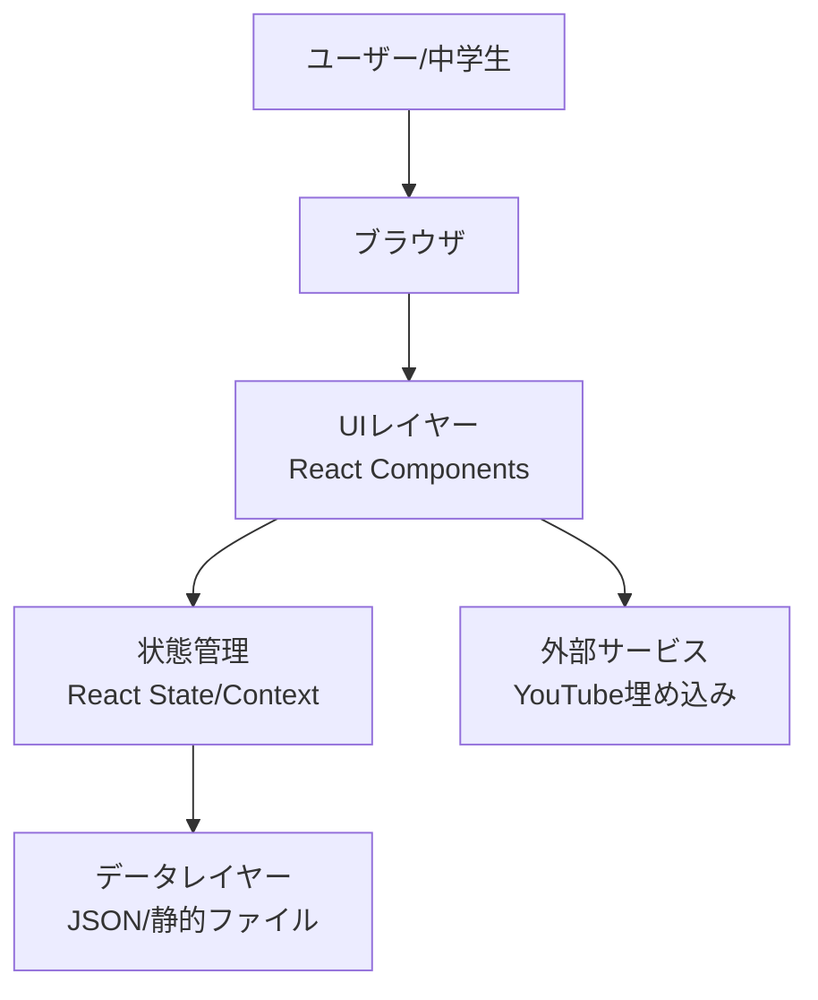
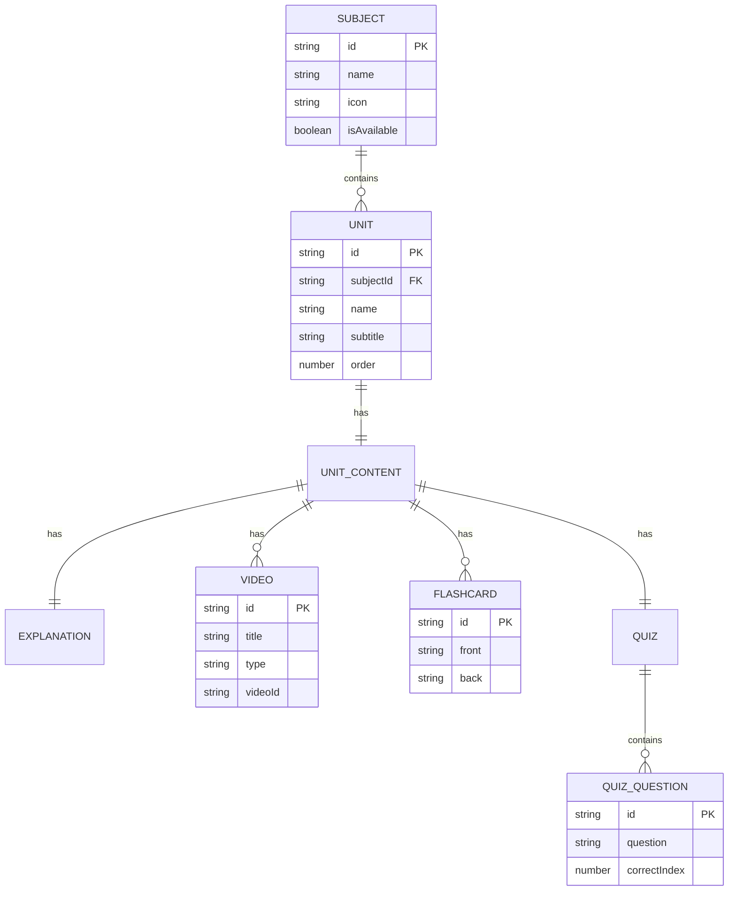
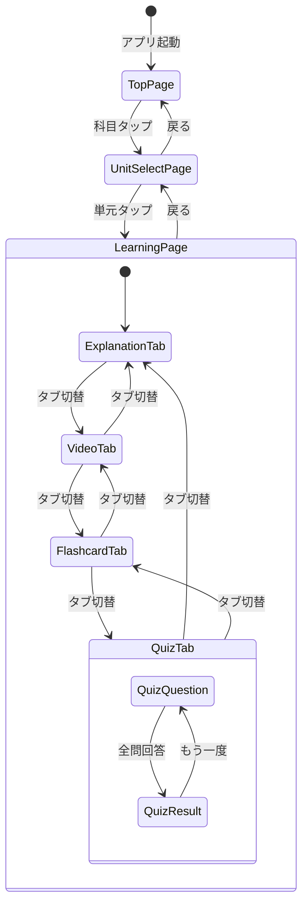
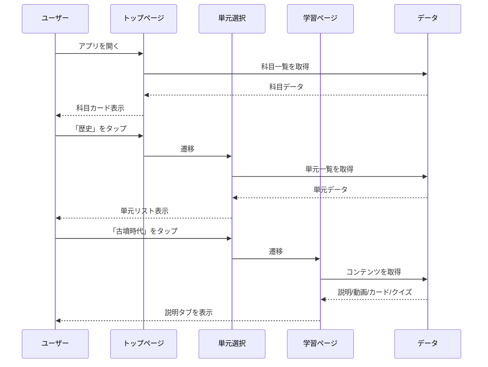
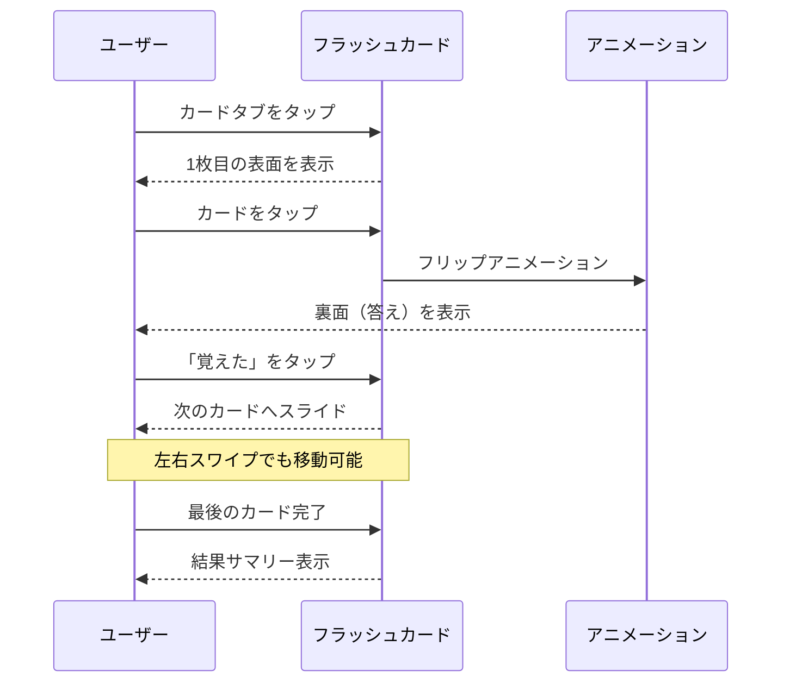
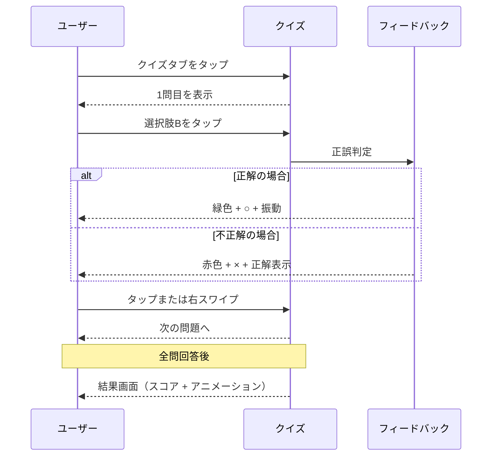

# 機能設計書 (Functional Design Document)

## システム構成図



## 技術スタック

| 分類 | 技術 | 選定理由 |
|------|------|----------|
| 言語 | TypeScript | 型安全性による品質向上、エディタ補完 |
| フレームワーク | React + Vite | 高速な開発体験、コンポーネント指向 |
| スタイリング | Tailwind CSS | ユーティリティファースト、スマホ対応が容易 |
| アニメーション | Framer Motion | 直感的なジェスチャー対応、スムーズなアニメーション |
| アイコン | Lucide React | 軽量、シンプルなアイコンセット |
| ホスティング | Vercel / Cloudflare Pages | 無料枠で十分、高速CDN |

## データモデル定義

### エンティティ: Subject（科目）

```typescript
interface Subject {
  id: string;           // "history", "math" など
  name: string;         // "歴史"
  icon: string;         // アイコン識別子
  description: string;  // "古代から現代まで"
  units: Unit[];        // 単元リスト
  isAvailable: boolean; // 利用可能か（MVP以降用）
}
```

### エンティティ: Unit（単元）

```typescript
interface Unit {
  id: string;           // "ancient-japan"
  subjectId: string;    // "history"
  name: string;         // "古墳時代"
  subtitle: string;     // "〜大きなお墓を作った時代〜"
  icon: string;         // アイコン識別子
  order: number;        // 表示順
  content: UnitContent; // 学習コンテンツ
}
```

### エンティティ: UnitContent（単元コンテンツ）

```typescript
interface UnitContent {
  explanation: Explanation;     // 説明資料
  videos: Video[];              // 動画リスト
  flashcards: Flashcard[];      // フラッシュカード
  quiz: Quiz;                   // クイズ
}
```

### エンティティ: Explanation（説明資料）

```typescript
interface Explanation {
  sections: ExplanationSection[];
}

interface ExplanationSection {
  title: string;           // セクションタイトル
  content: string;         // 本文（Markdown形式）
  image?: {
    src: string;
    alt: string;
    caption?: string;
  };
  keyPoints?: string[];    // 重要ポイント
}
```

### エンティティ: Video（動画）

```typescript
interface Video {
  id: string;
  title: string;
  description: string;
  type: 'horizontal' | 'vertical';  // 横型 or 縦型
  source: 'youtube' | 'external';
  videoId: string;         // YouTube動画ID
  duration?: string;       // "3:45"
  thumbnail?: string;      // サムネイルURL
}
```

### エンティティ: Flashcard（フラッシュカード）

```typescript
interface Flashcard {
  id: string;
  front: string;           // 表面（問題/用語）
  back: string;            // 裏面（答え/説明）
  hint?: string;           // ヒント（任意）
}
```

### エンティティ: Quiz（クイズ）

```typescript
interface Quiz {
  questions: QuizQuestion[];
}

interface QuizQuestion {
  id: string;
  question: string;        // 問題文
  options: string[];       // 選択肢（4つ）
  correctIndex: number;    // 正解のインデックス（0-3）
  explanation?: string;    // 解説（任意）
}
```

### ER図



## 画面遷移図



## コンポーネント設計

### ページコンポーネント

#### TopPage（トップページ）

**責務**:
- 科目カードの表示
- 科目選択のハンドリング

**Props**: なし

**状態**: なし（静的表示）

---

#### UnitSelectPage（単元選択ページ）

**責務**:
- 選択された科目の単元一覧表示
- 単元選択のハンドリング

**Props**:
```typescript
interface UnitSelectPageProps {
  subjectId: string;
}
```

---

#### LearningPage（学習ページ）

**責務**:
- タブナビゲーションの管理
- 各学習モードの表示切替

**Props**:
```typescript
interface LearningPageProps {
  subjectId: string;
  unitId: string;
}
```

**状態**:
```typescript
{
  activeTab: 'explanation' | 'video' | 'flashcard' | 'quiz';
}
```

### 共通UIコンポーネント

#### TabBar（タブバー）

**責務**:
- 画面下部固定のタブナビゲーション
- 現在のタブのハイライト表示

**Props**:
```typescript
interface TabBarProps {
  activeTab: TabType;
  onTabChange: (tab: TabType) => void;
  badges?: Partial<Record<TabType, boolean>>; // 未完了バッジ
}
```

---

#### Header（ヘッダー）

**責務**:
- ページタイトル表示
- 戻るボタン

**Props**:
```typescript
interface HeaderProps {
  title: string;
  subtitle?: string;
  onBack?: () => void;
}
```

---

#### ProgressBar（プログレスバー）

**責務**:
- 学習進捗の可視化

**Props**:
```typescript
interface ProgressBarProps {
  current: number;
  total: number;
}
```

### 学習モードコンポーネント

#### ExplanationView（説明資料ビュー）

**責務**:
- 説明セクションの表示
- 画像・キーポイントの表示

---

#### VideoPlayer（動画プレイヤー）

**責務**:
- 横型動画の表示（16:9）
- 縦型動画のスワイプ切替（9:16、TikTok風）

**Props**:
```typescript
interface VideoPlayerProps {
  videos: Video[];
  type: 'horizontal' | 'vertical';
}
```

**状態**:
```typescript
{
  currentIndex: number;
  isPlaying: boolean;
}
```

---

#### FlashcardDeck（フラッシュカードデッキ）

**責務**:
- カードのフリップアニメーション
- 左右スワイプでカード切替
- 「覚えた」「もう一度」の仕分け

**Props**:
```typescript
interface FlashcardDeckProps {
  cards: Flashcard[];
  onComplete?: (results: FlashcardResult[]) => void;
}
```

**状態**:
```typescript
{
  currentIndex: number;
  isFlipped: boolean;
  results: Map<string, 'remembered' | 'again'>;
}
```

---

#### QuizView（クイズビュー）

**責務**:
- 問題と選択肢の表示
- 正誤判定とフィードバック
- 結果サマリーの表示

**Props**:
```typescript
interface QuizViewProps {
  quiz: Quiz;
  onComplete?: (score: number, total: number) => void;
}
```

**状態**:
```typescript
{
  currentQuestionIndex: number;
  selectedAnswer: number | null;
  answers: number[];
  showResult: boolean;
}
```

## ユースケース詳細

### UC1: 単元を選んで学習を開始する



### UC2: フラッシュカードで学習する



### UC3: クイズに挑戦する



## UI設計

### カラーパレット

| 用途 | 色コード | 説明 |
|------|----------|------|
| プライマリー | `#6366F1` | インディゴ（メインアクション） |
| セカンダリー | `#F59E0B` | アンバー（アクセント） |
| 成功 | `#10B981` | エメラルド（正解、完了） |
| エラー | `#EF4444` | レッド（不正解） |
| 背景 | `#F9FAFB` | グレー50（ベース背景） |
| テキスト | `#1F2937` | グレー800（本文） |
| サブテキスト | `#6B7280` | グレー500（補足） |

### タイポグラフィ

| 要素 | サイズ | 重さ |
|------|--------|------|
| ページタイトル | 24px | Bold |
| セクションタイトル | 20px | SemiBold |
| 本文 | 16px | Regular |
| ボタン | 16px | Medium |
| キャプション | 14px | Regular |

### レイアウト基準

- 最大幅: 480px（中央寄せ）
- 左右パディング: 16px
- カード間隔: 12px
- タップ領域: 最小44px × 44px

### タブバーデザイン

```
┌─────────────────────────────────────────┐
│  [📖]      [🎬]      [🃏]      [❓]     │
│  まなぶ    動画      カード    クイズ   │
└─────────────────────────────────────────┘
```

- 高さ: 64px
- 背景: 白（影付き）
- アクティブ: プライマリーカラー
- 非アクティブ: グレー

### フラッシュカードデザイン

```
┌─────────────────────────────────┐
│                                 │
│                                 │
│         聖徳太子                │
│                                 │
│      タップしてめくる           │
│                                 │
│                                 │
└─────────────────────────────────┘
        ● ○ ○ ○ ○ （3/10）

    [もう一度]      [覚えた ✓]
```

### クイズデザイン

```
┌─────────────────────────────────┐
│ ━━━━━━━━━━━━━━━━━━ 3/5         │
│                                 │
│ 聖徳太子が定めた役人の          │
│ 心構えを示したものは？          │
│                                 │
│ ┌─────────────────────────────┐ │
│ │ A. 大化の改新               │ │
│ └─────────────────────────────┘ │
│ ┌─────────────────────────────┐ │
│ │ B. 十七条の憲法 ✓           │ │
│ └─────────────────────────────┘ │
│ ┌─────────────────────────────┐ │
│ │ C. 冠位十二階               │ │
│ └─────────────────────────────┘ │
│ ┌─────────────────────────────┐ │
│ │ D. 遣隋使                   │ │
│ └─────────────────────────────┘ │
└─────────────────────────────────┘
```

## ジェスチャー操作仕様

### フラッシュカード

| ジェスチャー | アクション |
|-------------|-----------|
| タップ | カードをめくる（表↔裏） |
| 左スワイプ | 次のカードへ |
| 右スワイプ | 前のカードへ |

### 縦型動画

| ジェスチャー | アクション |
|-------------|-----------|
| 上スワイプ | 次の動画へ |
| 下スワイプ | 前の動画へ |
| タップ | 再生/一時停止 |

### クイズ

| ジェスチャー | アクション |
|-------------|-----------|
| タップ（選択肢） | 回答を選択 |
| タップ/右スワイプ（判定後） | 次の問題へ |

## 初回ガイド表示

初めてそのコンポーネントを使う時のみ、操作ヒントを表示:

```
┌─────────────────────────────────┐
│                                 │
│         聖徳太子                │
│                                 │
│         👆                      │
│     タップでめくる              │
│     ← → スワイプで移動          │
│                                 │
└─────────────────────────────────┘
```

- 1回操作したらヒントを非表示
- localStorage で表示済みフラグを管理

## パフォーマンス最適化

- **画像の遅延読み込み**: Intersection Observer APIで画面に入ったら読み込み
- **コンポーネントの遅延読み込み**: React.lazyでタブごとに分割
- **動画の遅延読み込み**: 動画タブを開いた時に初めて埋め込みを生成
- **静的データのキャッシュ**: Service Workerでオフライン対応（将来）

## エラーハンドリング

### エラーの分類

| エラー種別 | 処理 | ユーザーへの表示 |
|-----------|------|-----------------|
| データ読み込みエラー | フォールバックUI表示 | 「読み込めませんでした。もう一度試してね」 |
| 動画読み込みエラー | プレースホルダー表示 | 「動画を読み込めませんでした」 |
| ネットワークエラー | オフライン表示 | 「インターネットに接続してね」 |

### エラー表示のトーン

- 中学生向けにやわらかい表現
- 「エラーが発生しました」→「うまくいかなかったみたい」
- 次のアクションを提示（「もう一度試す」ボタン）

## テスト戦略

### ユニットテスト

- データ変換ロジック
- クイズの正誤判定ロジック
- フラッシュカードの状態管理

### コンポーネントテスト

- 各コンポーネントの表示確認
- タブ切り替えの動作
- ジェスチャー操作の動作

### E2Eテスト

- 科目選択→単元選択→学習の一連のフロー
- クイズを最後まで完了するフロー
- フラッシュカードを一通りめくるフロー

### 手動テスト

- 実機（iPhone, Android）での操作感確認
- ジェスチャーの反応速度確認
- 異なる画面サイズでの表示確認
