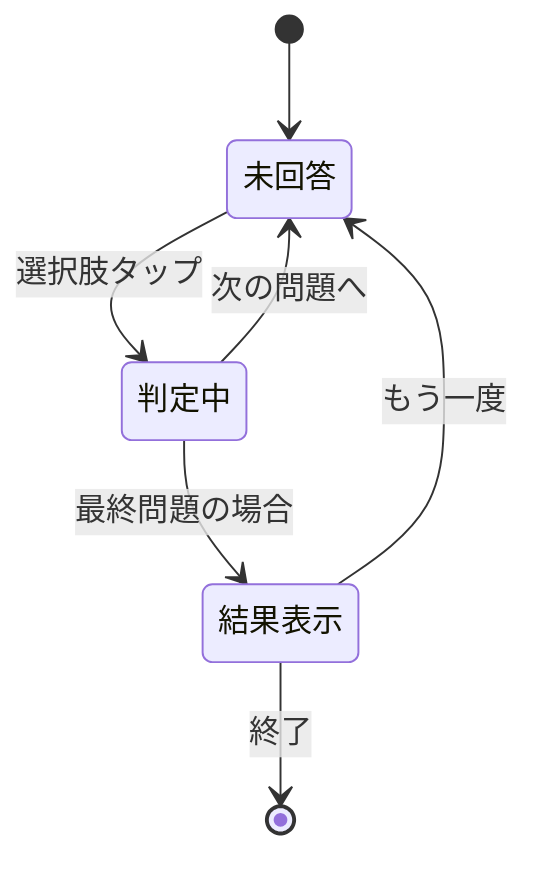

# プロジェクト用語集 (Glossary)

## 概要

このドキュメントは、まるっとスタディプロジェクト内で使用される用語の定義を管理します。

**更新日**: 2025-02-01

## ドメイン用語

プロジェクト固有のビジネス概念や機能に関する用語。

### 科目 (Subject)

**定義**: 学習対象となる教科のカテゴリ

**説明**: 中学校で学ぶ教科（歴史、数学、英語など）を表す最上位の分類単位。各科目には複数の単元が含まれる。

**関連用語**: 単元

**使用例**:
- 「歴史」科目を選択する
- 科目一覧からタップして選ぶ

**英語表記**: Subject

### 単元 (Unit)

**定義**: 科目内の学習テーマごとの区切り

**説明**: 1つの科目を構成する学習単位。例えば歴史科目の「古墳時代」「飛鳥・奈良時代」など。各単元には説明資料、動画、フラッシュカード、クイズが含まれる。

**関連用語**: 科目、コンテンツ

**使用例**:
- 「古墳時代」の単元を学習する
- 単元選択画面で学びたい内容を選ぶ

**英語表記**: Unit

### フラッシュカード (Flashcard)

**定義**: 表裏で問題と答えが対になった暗記用カード

**説明**: タップでめくって答えを確認できるデジタルカード。重要な用語や人物の暗記に使用。「覚えた」「もう一度」で仕分けが可能。

**関連用語**: カードデッキ

**使用例**:
- フラッシュカードをめくって暗記する
- 「覚えた」カードは次回表示されない

**英語表記**: Flashcard

### クイズ (Quiz)

**定義**: 学習内容の理解度を確認する4択問題

**説明**: 単元の内容に関する選択式の問題。正誤判定と解説により、学習の定着を支援。1セット5〜10問程度。

**関連用語**: 問題、選択肢、正誤判定

**使用例**:
- クイズに挑戦して理解度をチェック
- 全問正解を目指す

**英語表記**: Quiz

### 学習モード (Learning Mode)

**定義**: 学習ページ内で切り替え可能な4つの学習方法

**説明**: 「まなぶ」（説明資料）、「動画」、「カード」（フラッシュカード）、「クイズ」の4種類。タブバーで切り替える。

**関連用語**: タブ、タブバー

**使用例**:
- 「動画」モードで解説を見る
- 「カード」モードで用語を覚える

**英語表記**: Learning Mode

### タブバー (Tab Bar)

**定義**: 画面下部に固定表示される学習モード切替UI

**説明**: 「まなぶ」「動画」「カード」「クイズ」の4つのタブをアイコン+テキストで表示。タップで学習モードを切り替える。

**関連用語**: 学習モード

**使用例**:
- タブバーの「クイズ」をタップ
- 下のタブから好きな学習方法を選ぶ

**英語表記**: Tab Bar

## 技術用語

プロジェクトで使用している技術・フレームワーク・ツールに関する用語。

### React

**定義**: ユーザーインターフェースを構築するためのJavaScriptライブラリ

**公式サイト**: https://react.dev/

**本プロジェクトでの用途**: UIコンポーネントの構築、状態管理

**バージョン**: 18.x

**関連ドキュメント**: docs/architecture.md

### Vite

**定義**: 高速な開発サーバーとビルドツール

**公式サイト**: https://vitejs.dev/

**本プロジェクトでの用途**: 開発サーバー、本番ビルド、HMR（ホットモジュールリプレースメント）

**バージョン**: 5.x

### Tailwind CSS

**定義**: ユーティリティファーストのCSSフレームワーク

**公式サイト**: https://tailwindcss.com/

**本プロジェクトでの用途**: スタイリング、レスポンシブデザイン

**バージョン**: 3.x

### Framer Motion

**定義**: React向けのアニメーションライブラリ

**公式サイト**: https://www.framer.com/motion/

**本プロジェクトでの用途**: カードフリップ、スワイプジェスチャー、ページ遷移アニメーション

**バージョン**: 11.x

### TypeScript

**定義**: JavaScriptに静的型付けを追加した言語

**公式サイト**: https://www.typescriptlang.org/

**本プロジェクトでの用途**: 型安全なコード記述、エディタ補完

**バージョン**: 5.x

## 略語・頭字語

### MVP

**正式名称**: Minimum Viable Product

**意味**: 実用最小限の製品。最小限の機能で価値を提供できる状態

**本プロジェクトでの使用**: 初期リリースの機能範囲を指す。歴史科目のみ、基本的な4つの学習モードを含む

### PRD

**正式名称**: Product Requirements Document

**意味**: プロダクト要求定義書

**本プロジェクトでの使用**: docs/product-requirements.md

### UI

**正式名称**: User Interface

**意味**: ユーザーインターフェース。ユーザーが操作する画面や要素

**本プロジェクトでの使用**: ボタン、カード、タブなどの視覚的要素

### UX

**正式名称**: User Experience

**意味**: ユーザー体験。ユーザーがプロダクトを使用する際の体験全体

**本プロジェクトでの使用**: 中学生が「難しそう」と感じない体験設計

### HMR

**正式名称**: Hot Module Replacement

**意味**: コード変更時にページ全体を再読み込みせずに変更を反映する機能

**本プロジェクトでの使用**: Viteの開発サーバーで使用

## アーキテクチャ用語

### コンポーネント (Component)

**定義**: UIの再利用可能な部品

**本プロジェクトでの適用**: React関数コンポーネントとして実装。`src/components/` に配置

**関連コンポーネント**: Header, TabBar, FlashcardDeck, QuizView など

### カスタムフック (Custom Hook)

**定義**: Reactの状態管理やロジックを再利用可能にした関数

**本プロジェクトでの適用**: `src/hooks/` に配置。useSwipe, useQuiz など

### ページ (Page)

**定義**: ルーティングに対応する最上位のコンポーネント

**本プロジェクトでの適用**: `src/pages/` に配置。TopPage, UnitSelectPage, LearningPage

## ステータス・状態

### フラッシュカードの状態

| ステータス | 意味 | 遷移条件 | 次の状態 |
|----------|------|---------|---------|
| 未表示 | まだ表示されていない | カードデッキを開く | 表面表示中 |
| 表面表示中 | 問題/用語が見えている | タップ | 裏面表示中 |
| 裏面表示中 | 答え/説明が見えている | タップ | 表面表示中 |
| 覚えた | ユーザーが「覚えた」を選択 | 「覚えた」ボタン | 完了 |
| もう一度 | ユーザーが「もう一度」を選択 | 「もう一度」ボタン | 再出題待ち |

### クイズの状態

| ステータス | 意味 | 遷移条件 | 次の状態 |
|----------|------|---------|---------|
| 未回答 | 問題表示中、選択肢未選択 | 選択肢をタップ | 判定中 |
| 判定中 | 正誤を表示中 | タップ/スワイプ | 次の問題/結果表示 |
| 結果表示 | 全問終了、スコア表示 | 「もう一度」タップ | 未回答（最初から） |

**状態遷移図**:

## データモデル用語

### Subject（科目エンティティ）

**定義**: 学習科目を表すデータ構造

**主要フィールド**:
- `id`: 科目の一意識別子（例: "history"）
- `name`: 表示名（例: "歴史"）
- `units`: 含まれる単元の配列

**関連エンティティ**: Unit

### Unit（単元エンティティ）

**定義**: 学習単元を表すデータ構造

**主要フィールド**:
- `id`: 単元の一意識別子（例: "ancient-japan"）
- `name`: 表示名（例: "古墳時代"）
- `subtitle`: サブタイトル（例: "〜大きなお墓を作った時代〜"）
- `content`: 学習コンテンツ（説明、動画、カード、クイズ）

**関連エンティティ**: Subject, Flashcard, Quiz

### Flashcard（フラッシュカードエンティティ）

**定義**: フラッシュカード1枚を表すデータ構造

**主要フィールド**:
- `id`: カードの一意識別子
- `front`: 表面のテキスト（問題/用語）
- `back`: 裏面のテキスト（答え/説明）
- `hint`: ヒント（任意）

### QuizQuestion（クイズ問題エンティティ）

**定義**: クイズの1問を表すデータ構造

**主要フィールド**:
- `id`: 問題の一意識別子
- `question`: 問題文
- `options`: 選択肢の配列（4つ）
- `correctIndex`: 正解のインデックス（0-3）
- `explanation`: 解説（任意）

## UI用語

### プログレスバー (Progress Bar)

**定義**: 学習の進捗を視覚的に示す横長のバー

**使用箇所**: クイズページ上部、フラッシュカードページ

### ドットインジケーター (Dot Indicator)

**定義**: 現在位置と総数を示す点の並び（● ○ ○ ○ ○）

**使用箇所**: フラッシュカードの下部

### フィードバック (Feedback)

**定義**: ユーザーの操作に対する視覚的・触覚的な応答

**使用例**:
- 正解時: 緑色表示 + ○アイコン + 振動
- 不正解時: 赤色表示 + ×アイコン
- カードフリップ: 3Dアニメーション

## ジェスチャー用語

### スワイプ (Swipe)

**定義**: 画面上で指を滑らせる操作

**本プロジェクトでの使用**:
- 左右スワイプ: フラッシュカードの切り替え
- 上スワイプ: 縦型動画の次へ

### タップ (Tap)

**定義**: 画面を軽く触れる操作

**本プロジェクトでの使用**:
- カードをめくる
- 選択肢を選ぶ
- ボタンを押す

### フリップ (Flip)

**定義**: カードを裏返すアニメーション

**本プロジェクトでの使用**: フラッシュカードの表裏切り替え時の3D回転アニメーション
