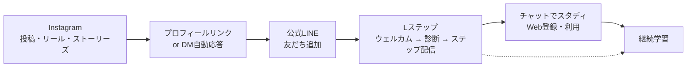

# チャットでスタディ × Instagram × 公式LINE（Lステップ）戦略メモ

> このドキュメントは戦略立案の壁打ち成果物です。決定事項ではなく、議論のたたき台として使用してください。

---

## 0. 全体像（最重要）

### ゴール
**Instagramで認知・興味を獲得 → 公式LINEに友だち登録 → Lステップでナーチャリング → チャットでスタディ（Web）の登録／利用に転換する**

### 導線フロー



### 各チャネルの役割

| チャネル | 役割 | 主要KPI |
|----------|------|---------|
| Instagram | **認知・興味喚起**（広く浅くリーチ） | フォロワー / リーチ / プロフィールタップ |
| 公式LINE（+ Lステップ） | **関係構築・ナーチャリング**（深く狭く） | 友だち追加数 / シナリオ完走率 / Web送客数 |
| チャットでスタディ | **学習体験の本体・最終ゴール** | WAU / クイズ完了率 / 継続率 |

> ⚠️ **重要**: Instagramで完結させない／LINE単体で完結させない。両方ともWebに送り込むための「入口」と割り切る。

---

## 1. サービス概要（前提として）

### プロダクト
**チャットでスタディ** — 中学生のためのスマホ学習サイト
- 教科: 歴史 / 地理 / 英語 / 数学 / 理科（中1〜中3）
- 形式: チャット解説 / フラッシュカード / クイズ / 動画
- 約263トピック収録
- **登録不要・無料**

### コンセプト
1. スマホで気軽に
2. シンプルで迷わない
3. 飽きない仕組み（3ステップ学習：理解 → 暗記 → 確認）

### ターゲット
- **中学生本人**（特に中2女子・スマホ依存度高）
- **保護者**（教育意識のある母親層、Instagramユーザーと重なる）

> 💡 Instagram戦略上、**保護者層（特に30〜45歳の母親）も主要ターゲット**として明確に位置づける。中学生本人は短尺動画で、保護者は投稿・ストーリーで攻める。

---

## 2. Instagram戦略

### アカウント設計

#### コンセプト案
**「中学生の毎日を、ちょっと賢くする教育メディア」**
- 中学生本人にも届くトーン
- 保護者が「これ、うちの子に教えたい」と思える内容
- マスコットキャラクター（既存：`docs/ideas/mascot-character-prompts.md`）を全面に

#### プロフィール最適化
- **アカウント名**: 「チャットでスタディ｜中学生のスマホ学習」
- **bio**: 「📚中学生のスマホ学習サイト / ✏️5教科・263トピック / 🎯テスト前にサクッと予習復習 / 👇LINEで「今日の1問」配信中」
- **リンク**: Lステップ生成のLINE登録URL（複数導線ならlit.link / Linktree使用）
- **ハイライト**: 「使い方」「教科別」「テスト対策」「保護者の方へ」

### コンテンツ戦略

#### 投稿タイプ別の役割

| タイプ | 目的 | 頻度 | 主な視聴者 |
|--------|------|------|------------|
| **リール（短尺動画）** | 認知拡大・新規リーチ | 週3〜5本 | 中学生本人 |
| **フィード投稿（カルーセル）** | 保存・シェア促進 | 週2〜3本 | 保護者 |
| **ストーリーズ** | 既存フォロワーとの接点維持 | 毎日 | フォロワー全体 |
| **ライブ** | テスト前などイベント時 | 月1回程度 | 中学生＋保護者 |

#### コンテンツテーマ（ピラー）

1. **「1分で覚える」シリーズ**（リール）
   - 例: 「1分で覚える鎌倉幕府」「1分で解ける一次方程式」
   - 最後に「もっと知りたい人はLINEへ→」のCTA

2. **「中学生のあるある」シリーズ**（リール）
   - 共感系。教育コンテンツに馴染ませて間口を広げる

3. **「保護者向け学習Tips」**（カルーセル投稿）
   - 例: 「中1の数学でつまずくポイントTOP5」
   - 保存・シェアされやすい知識系

4. **「今日の1問」**（ストーリーズ）
   - クイズ形式のスタンプを使い、エンゲージメント獲得
   - 詳しい解説はLINEへ誘導

5. **「成績アップ実例」「使ってみた声」**（フィード/リール）
   - 社会的証明（信頼獲得）

### Instagram → LINE 誘導の仕掛け

| 仕掛け | 内容 |
|--------|------|
| プロフィールリンク | Lステップ発行のLINE登録URL（友だち追加で「テスト対策クイズ集」プレゼント等の特典明記） |
| リール内CTA | 「続きはLINEで！プロフィールリンクから3秒で登録」 |
| ストーリーズのリンクスタンプ | 投稿ごとに直接LINE登録URLを貼る |
| **DM自動応答** | 特定キーワードをDMで送ってもらう→Lステップ連携で自動返信＋LINE登録URL案内（Meta公式機能） |
| ハイライトの最後 | 必ず「LINEに登録」ボタン |
| 投稿キャプション末尾 | 毎回必ずLINE誘導の定型文 |

#### DM自動応答の活用例
- リールで「コメントに『5教科』と書いてくれた人にDMで限定資料送ります」
- コメント欄が活性化 → アルゴリズムで拡散 → DM受信者にLINE誘導

### Instagram運用KPI

| Phase | 期間 | フォロワー | 月間プロフィールタップ | LINE登録への転換率 |
|-------|------|-----------|------------------------|--------------------|
| Phase 1 | 0〜3ヶ月 | 500〜1,000 | 1,000 | 10% (= LINE 100友だち/月) |
| Phase 2 | 4〜6ヶ月 | 3,000 | 5,000 | 12% |
| Phase 3 | 7〜12ヶ月 | 10,000 | 20,000 | 15% |

---

## 3. 公式LINE × Lステップ戦略

### Lステップを前提とする理由

LINE公式単体では実現できない、本戦略に必須の機能:

| Lステップ機能 | 本戦略での使い方 |
|---------------|------------------|
| **ステップ配信** | 友だち追加直後の7日間でナーチャリング（最重要） |
| **回答フォーム** | 学年・教科・テスト時期などを取得 → セグメント基盤 |
| **タグ管理** | 「中2」「数学が苦手」「テスト前」などで自動分類 |
| **リッチメニュー切替** | タグごとに最適化されたメニューを表示 |
| **シナリオ分岐** | 学年・教科で異なる配信内容を出し分け |
| **スコアリング** | 反応の良いユーザーを自動抽出 |
| **流入経路分析** | Instagramのどの投稿経由か計測 |

### Lステップの料金プラン（参考）
- スタートプラン: 2,980円/月（友だち1,000人まで）
- スタンダードプラン: 21,780円/月（友だち15,000人まで）
- → **Phase 1はスタートプランで十分**

### 友だち追加直後のシナリオ設計

```
Day 0（追加直後）
  └─ ウェルカム＋特典配布（テスト対策クイズ集PDF or サイトのテスト対策ページ直リンク）

Day 0（特典配布の3分後）
  └─ 学年診断フォーム（中1/中2/中3）→ タグ付与

Day 0（学年回答の直後）
  └─ 興味のある教科ヒアリング（複数選択）→ タグ付与

Day 1
  └─ 「サイトの使い方」紹介（30秒動画＋チャットでスタディへの直リンク）

Day 2
  └─ 学年・教科に合わせた「今日の1問」 → 解説はサイトで（送客）

Day 3
  └─ お悩み診断（「テスト前？普段の予習復習？苦手克服？」）→ シナリオ分岐

Day 5
  └─ 利用者の声・社会的証明

Day 7
  └─ 「使ってみてどう？」アンケート＋ヘビーユーザー化への招待
```

### 定常配信（ステップ完走後）

| 曜日 | コンテンツ | 目的 |
|------|------------|------|
| 月 | 今週の学習チャレンジ | 学習トリガー |
| 水 | 今日の1問（学年別） | 接触頻度維持＋送客 |
| 金 | 週末復習リマインド | リテンション |

**イベント配信**:
- 中間/期末テスト前2週間：頻度アップ＋テスト対策コンテンツ
- 学年切替期：新学年トピック紹介
- 長期休暇前：復習＆予習プラン提案

### リッチメニュー設計（タグ別出し分け）

#### デフォルト（学年未回答者）
```
┌──────────┬──────────┬──────────┐
│ 学年を教えて │ サイトを開く │ 今日の1問 │
├──────────┼──────────┼──────────┤
│ 教科から探す │ 使い方ガイド │ よくある質問 │
└──────────┴──────────┴──────────┘
```

#### 学年タグ付与後（例: 中2）
```
┌──────────┬──────────┬──────────┐
│ 中2の数学   │ 中2の英語   │ 中2の理科   │
├──────────┼──────────┼──────────┤
│ ランダムクイズ │ サイトを開く │ テスト対策 │
└──────────┴──────────┴──────────┘
```

#### テスト期間タグ付与時
```
┌──────────┬──────────┬──────────┐
│ テスト範囲を絞り込む │ 弱点克服クイズ │ 暗記カード │
├──────────┼──────────┼──────────┤
│ 過去問チャレンジ  │ サイトを開く │ 応援メッセージ │
└──────────┴──────────┴──────────┘
```

### キーワード自動応答（FAQボット代替）
- 「比例」「鎌倉時代」など教科用語 → 該当トピックへの直リンク
- 「テスト」→ テスト対策メニューへ
- 「使い方」→ ガイド動画へ

---

## 4. チャットでスタディ（Web）側の対応

### LINE/Lステップ運用に必要なWeb側の機能

| 優先度 | 機能 | 実装内容 |
|--------|------|----------|
| ★★★ | UTMパラメータ受け入れ・計測 | LINE/Instagramからの流入をGA4で識別 |
| ★★★ | LINE誘導バナー | クイズ結果画面、トップページ、トピック完了時 |
| ★★ | ディープリンク対応 | LINEメッセージから特定トピックに直接遷移できるURL設計（既に実装済みのルーティングを活用） |
| ★★ | 「今日の1問」用の単問URL | 1問だけ表示する軽量ページ |
| ★ | 学習進捗のLocalStorage活用 | LINE側からシナリオで「最近やった単元」を提示する素材に |

### 計測体制
- **GA4 + UTM**で流入元別のセッションを計測
- 計測項目: Instagram経由 / LINE経由 / Lステップシナリオの何日目経由 / どのリッチメニュー経由
- LINE→Web→学習完了までのファネル可視化

---

## 5. ロードマップ

### Phase 0: 準備（〜2週間）

**ゴール**: 全チャネルの土台づくり

- [ ] Instagramアカウント開設・プロフィール整備
- [ ] LINE公式アカウント開設
- [ ] Lステップ契約（スタートプラン）
- [ ] マスコットキャラ画像・バナー素材準備
- [ ] LINE登録特典（テスト対策クイズ集PDF など）作成
- [ ] サイトにLINE誘導バナー設置（最低3箇所）
- [ ] UTMパラメータ運用ルール策定・GA4設定
- [ ] Lステップのウェルカム＆7日ステップ配信を設計・登録

**判断基準**: 全シナリオを自分でテスト通過できること

### Phase 1: 立ち上げ（1〜3ヶ月目）

**ゴール**: Instagramフォロワー1,000人 / LINE友だち300人

- [ ] Instagram投稿開始（リール週3、フィード週2、ストーリーズ毎日）
- [ ] DM自動応答（コメント連動）の運用開始
- [ ] LINE/Lステップの数値モニタリング（開封率、ブロック率、シナリオ完走率）
- [ ] 月次振り返り＆コンテンツPDCA

**判断ポイント**: ブロック率5%超ならシナリオ再設計／フォロワー伸び悪ければコンテンツテーマ見直し

### Phase 2: 定着＆セグメント運用（4〜6ヶ月目）

**ゴール**: Instagramフォロワー3,000人 / LINE友だち1,000人 / LINE経由WAU比率 30%

- [ ] タグ別リッチメニュー切替の実装
- [ ] テスト期間特化キャンペーン（中間/期末）
- [ ] Instagram広告のテスト出稿（ターゲット: 保護者）
- [ ] ヘビーユーザー向けの追加シナリオ作成（「上級者向けクイズ」）

### Phase 3: 拡大（7〜12ヶ月目）

**ゴール**: Instagramフォロワー10,000人 / LINE友だち3,000人 / WAU貢献の主要チャネル化

- [ ] 友だち招待キャンペーン
- [ ] インフルエンサー（教育系・子育て系）とのコラボ
- [ ] 学校・塾向け配布キット作成
- [ ] Lステップのスコアリング機能でセグメント精緻化
- [ ] LINE有料プラン or Lステップ上位プランへ移行

---

## 6. KPIダッシュボード（Phase別）

| 指標 | Phase 1 (3ヶ月) | Phase 2 (6ヶ月) | Phase 3 (12ヶ月) |
|------|----------------|------------------|-------------------|
| Instagram フォロワー | 1,000 | 3,000 | 10,000 |
| Instagram → LINE 月間追加 | 100 | 250 | 500 |
| LINE 友だち累計 | 300 | 1,000 | 3,000 |
| LINE ブロック率 | <5% | <5% | <5% |
| 7日シナリオ完走率 | 50% | 60% | 70% |
| LINE 経由 月間Webセッション | 500 | 2,000 | 6,000 |
| LINE 経由 WAU 比率 | 20% | 30% | 50% |

---

## 7. リスクと対策

| リスク | 兆候 | 対策 |
|--------|------|------|
| Instagram投稿が伸びない | リーチが横ばい3ヶ月 | テーマ・形式を抜本変更／別アカウント分割検討 |
| LINEブロック率高い | 5%超 | ステップ配信間隔・本数を調整 |
| Lステップの設定が複雑で運用が回らない | 配信設定漏れ・タグ崩れ | 月次の運用棚卸し＆チェックリスト化 |
| 中学生がLINE登録に抵抗 | 友だち増えない | 保護者層向けに振り切る／プレゼント特典を強化 |
| 個人情報の管理 | 苦情・問題 | LINE/Lステップ内のデータのみで完結、Webと紐付けない |
| Instagramのアルゴリズム変更 | 急激なリーチ減 | 複数チャネル展開（TikTok / YouTube Shorts）併走 |

---

## 8. 次のアクション（Quick Wins）

すぐ着手できる優先タスク:

1. **Lステップを契約する**（スタートプランで開始）
2. **公式LINEアカウント・Instagramアカウントを開設**
3. **登録特典の制作**（「中学生5教科テスト対策クイズ50問PDF」が定番）
4. **Lステップのウェルカム→7日ステップ配信のシナリオを設計・登録**
5. **Instagram初期投稿10本のドラフト作成**（リール5本＋カルーセル5本）
6. **サイトにLINE誘導バナー追加**（クイズ結果画面・トップページ・トピック完了時）
7. **UTM運用ルールとGA4の計測設定**

---

## 9. Instagramプロフィール文（一問一答アカウント）

> **想定アカウント**: 毎日「一問一答」動画を投稿する中学生向け定期テスト対策アカウント。
> 公式LINE（Lステップ）への送客が最終ゴール。

### アカウント名（表示名・最大30字）

| 案 | 文言 | 字数 | 備考 |
|----|------|------|------|
| A（推奨） | `一問一答｜中学テスト対策｜1日1分` | 17 | キーワード詰め込み・検索に強い |
| B | `1日1分の一問一答｜中学生のテスト対策` | 19 | 価値訴求が前面 |
| C | `中2の一問一答｜英・歴・地のテスト対策` | 19 | 学年・教科で絞り込み |

### 自己紹介文（bio・150字以内）

一問一答 | 中2歴史・英語・理科 | 1日1分で定期テスト対策
📝テスト前に「カンタン総復習」
🏫学習塾塾長経験者(東大大学院出身)による安心クオリティ
🎁公式LINEで「あなたのテスト範囲に合わせた今日の1問」を無料配信
👇登録は下のリンクから
※今後ほかの教科も配信予定

#### 案A：王道・推奨（約105字）

```
📝1日1分の一問一答で定期テスト対策
🏫東大院出身・塾長監修の安心クオリティ
✏️英語・歴史・地理をチャットでサクッと総復習
🎁公式LINEで「あなたのテスト範囲に合わせた1問」配信中
👇登録はこちらから
```

#### 案B：中2特化・尖らせ版（約100字）

```
📝中2の一問一答｜1日1分で定期テスト対策
🏫学習塾塾長（東大院出身）監修
✏️英語・歴史・地理をチャット形式でカンタン総復習
🎁公式LINEで「テスト範囲に合わせた今日の1問」配信中👇
```

#### 案C：保護者にも刺さる版（約115字）

```
📚中学生のテスト前「総復習」の新定番
📝1日1分の一問一答（英語・歴史・理科）※今後ほかの教科も配信予定
🏫東大院出身・現役塾長が監修
🎁公式LINEで「あなたのテスト範囲に合わせた今日の1問」を無料配信
👇登録はプロフィールのリンクから
```

> 💡 **推奨は案A**。「中2」と限定すると検索流入は増えるが、中1・中3の保存・フォローを取り逃がす。
> 投稿側でしっかり「中2向け」と明示すれば、bioでは中学生全体を受け止める方が機会損失が少ない。

### 外部リンク（プロフィールリンク）

- メインリンク: `https://lin.ee/wxDOngU`（公式LINE登録）
- 表示テキスト案: `▶ 公式LINEで「今日の1問」を受け取る`
- 将来的に複数導線が必要になったら lit.link / Linktree / Linkin.bio を検討

### ハイライト構成（カバー作成時の指針）

| 並び順 | タイトル | 役割 |
|--------|----------|------|
| 1 | はじめに | アカウントの世界観・自己紹介 |
| 2 | 英語の一問一答 | 教科別アーカイブ |
| 3 | 歴史の一問一答 | 教科別アーカイブ |
| 4 | 地理の一問一答 | 教科別アーカイブ |
| 5 | テスト対策 | テスト2週間前にまとめて見たい人向け |
| 6 | LINE登録特典 | 公式LINEへの誘導動線 |
| 7 | 保護者の方へ | 安心材料（運営者紹介・実績） |

### キャプション末尾の定型文（毎投稿で再利用）

```
ーーーーーーーーーーーーーー
🎁プロフィールの公式LINEに登録すると、
あなたの「テスト範囲に合わせた今日の1問」が毎日届きます。

▶ @[アカウントID] のプロフィールから3秒で登録
ーーーーーーーーーーーーーー
#一問一答 #中学生 #定期テスト対策 #中2 #中学英語 #中学歴史 #中学地理 #勉強垢 #テスト勉強 #塾講師
```

### 命名・トーンの注意点

- 「東大大学院出身」は信頼形成のためbioに必須。ただし主役にしない（**主役は「1日1分」「一問一答」**）
- 「カンタン」「サクッと」など平易な言葉を多用し、勉強嫌いでも刺さるトーンに統一
- 絵文字は1行1個まで（情報量過多を避ける）
- 装飾より「次の行動（LINE登録）」が一目でわかる導線設計を優先

---

## 10. 未決事項（要相談）

- アカウント名は「チャットでスタディ」ベース or マスコット名前面か？
- Instagramのターゲットは中学生本人と保護者、どちらに重心を置くか？
  - **推奨**: 立ち上げ期は保護者寄り（拡散・登録の決定権がある）。慣れてきたら本人寄りに広げる
- LINE登録特典は何にするか？
  - 候補: 「テスト対策クイズ50問PDF」「学年別暗記カード一覧」「マスコット限定壁紙」
- Lステップの運用工数は誰がもつか？（コンテンツ制作とは別工数）
- Instagram広告予算を確保するか？（Phase 2以降推奨：月3〜5万円〜）
- 配信時刻（推奨案）：
  - LINE平日17時（放課後）
  - Instagram平日19〜21時（保護者がスマホを見る時間帯）
